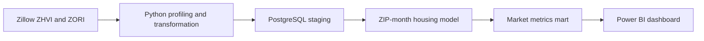

# EstateFlow

EstateFlow is an end-to-end housing-market analytics pipeline that turns public Zillow data into analysis-ready ZIP-month metrics. The project is being built as a production-style data workflow, with explicit source research, repeatable Python transformations, PostgreSQL modelling, reconciliation and data-quality controls.

> **Current stage:** the core pipeline foundation and first analytical mart are complete. Dashboard development and automated orchestration are next.

## The question

How can housing markets be compared consistently over time using both home values and rents?

EstateFlow currently models one row per **ZIP code and month**, allowing analysis of:

- Typical home values
- Typical monthly rents
- Annualised rent
- Gross rent-to-value percentage
- Differences across ZIP codes, cities, metros, counties and states
- Market movement over time

## Pipeline



The Power BI layer is planned and is not yet included in the repository.

## What is implemented

### Source research

- Documented Zillow Home Value Index (ZHVI) and Zillow Observed Rent Index (ZORI)
- Recorded grain, coverage, units, missing-data risks and modelling limitations
- Preserved ZIP codes as text to retain leading zeroes

### Python data preparation

- Profiled raw ZHVI and ZORI files
- Reshaped monthly data from wide to long format
- Standardised names and data types
- Added assertions for positive values, valid ZIP codes, duplicate ZIP-months and state consistency
- Added chunked ZHVI loading and row-count reconciliation against PostgreSQL

### SQL modelling

- Created separate PostgreSQL schemas for staging, intermediate models and marts
- Joined ZHVI and ZORI at the shared ZIP-month grain
- Built `marts.zip_month_market_metrics`
- Calculated annualised rent and gross rent-to-value percentage

### Data quality

- Row-count reconciliation between pipeline layers
- Required-value checks
- Positive-value checks
- Duplicate ZIP-month checks
- Independent recalculation of derived metrics

## Analytical model

The current mart exposes the following fields:

| Category | Fields |
| --- | --- |
| Geography | ZIP code, city, metro, county, state |
| Time | Month |
| Source measures | ZHVI, ZORI |
| Derived measures | Annualised rent, gross rent-to-value percentage |

Gross rent-to-value percentage is calculated as:

```text
(monthly rent × 12 ÷ home value) × 100
```

It is a high-level market comparison metric, not a complete investment return. It does not yet account for financing, vacancy, taxes, insurance, maintenance or transaction costs.

## Technology

- Python 3.12
- pandas
- PostgreSQL 17
- psycopg
- Docker Compose
- SQL
- uv
- Power BI, planned

## Repository structure

```text
EstateFlow/
├── data/
│   ├── raw/
│   └── processed/
├── docs/                  # Source research and data notes
├── powerbi/               # Planned dashboard assets
├── sql/
│   ├── staging/           # Typed source tables
│   ├── intermediate/      # Joined ZIP-month model
│   ├── marts/             # Analysis-ready metrics
│   └── quality/           # Reconciliation and validation queries
├── src/estateflow/        # Python profiling and transformations
├── tests/
├── compose.yaml
└── pyproject.toml
```

## Local setup

1. Clone the repository and enter the project directory.

   ```bash
   git clone https://github.com/yuvrajriyar/EstateFlow.git
   cd EstateFlow
   ```

2. Create the local environment file.

   ```bash
   cp .env.example .env
   ```

3. Install the Python environment.

   ```bash
   uv sync
   ```

4. Start PostgreSQL.

   ```bash
   docker compose up -d
   ```

5. Run the source profiling, transformation and SQL files in pipeline order.

The project is still under active development, so a single orchestration command has not yet been added.

## Next milestones

- Complete repeatable ZORI loading into PostgreSQL
- Add a single pipeline runner for the full workflow
- Add automated Python and SQL tests
- Build the first Power BI dashboard
- Add market ranking and trend measures
- Evaluate additional economic and demographic sources from FRED and the US Census Bureau
- Add CI checks and clearer run documentation

## Data sources

- [Zillow Home Value Index](https://www.zillow.com/research/data/)
- [Zillow Observed Rent Index](https://www.zillow.com/research/data/)

Detailed source assessments are available in [`docs/source-notes-zhvi.md`](docs/source-notes-zhvi.md) and [`docs/source-notes-zori.md`](docs/source-notes-zori.md).

## Author

Built by [Yuvraj Riyar](https://github.com/yuvrajriyar) as a hands-on data engineering and analytics project.
