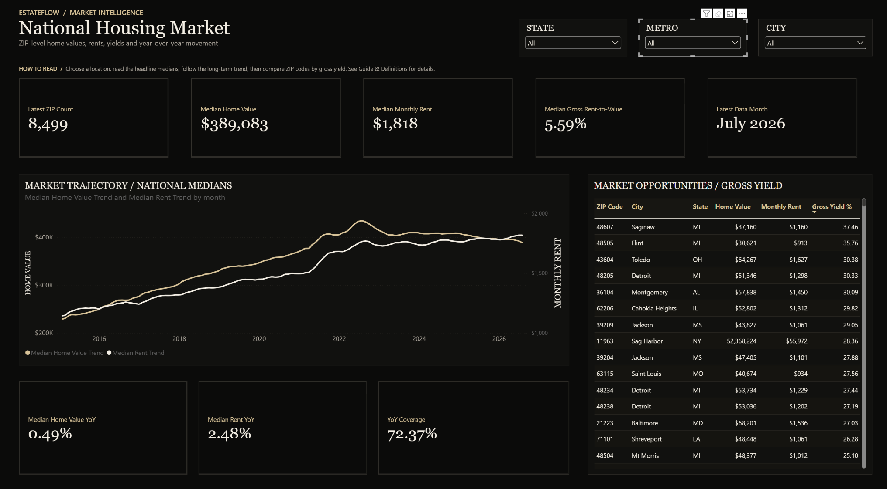
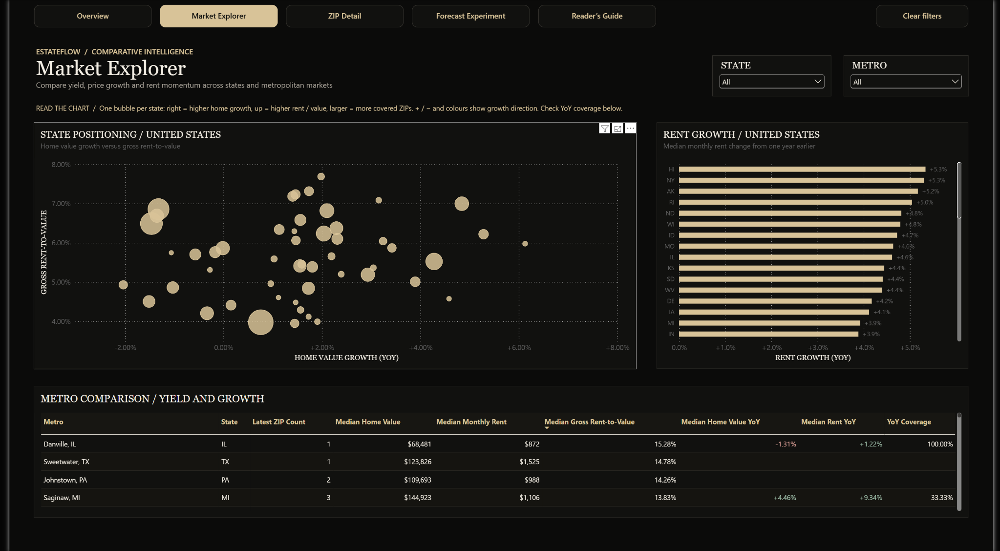
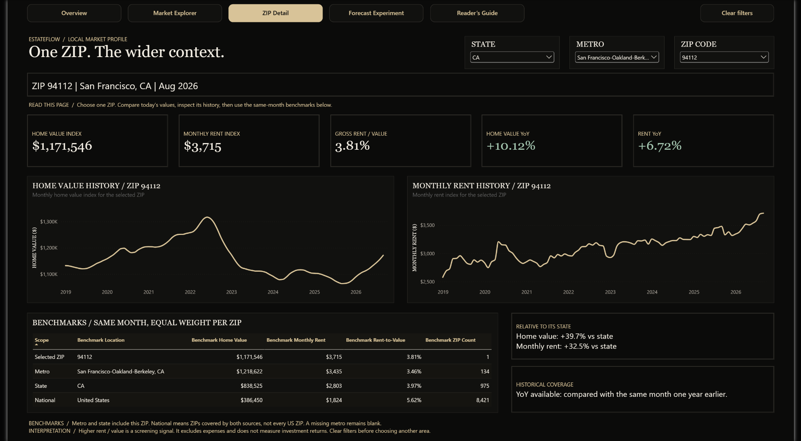
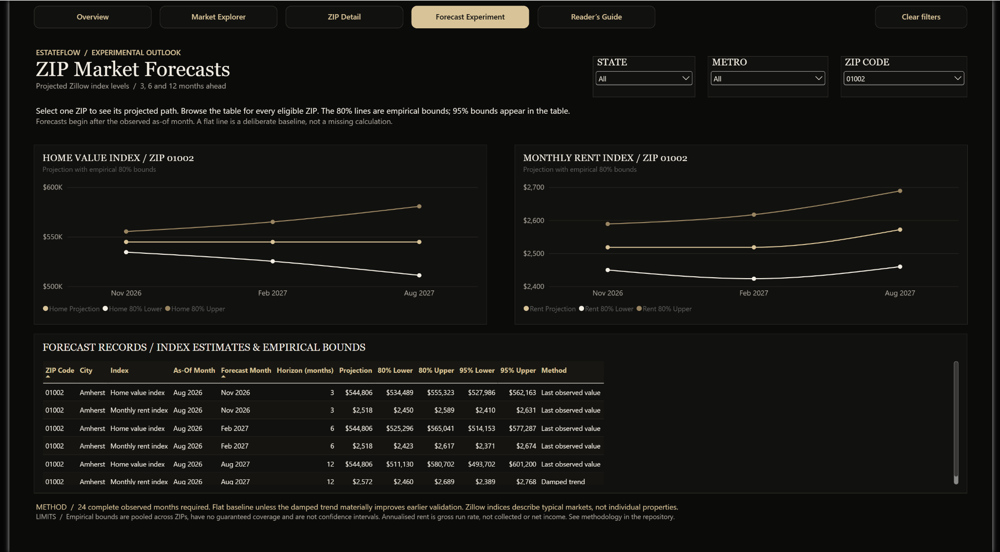
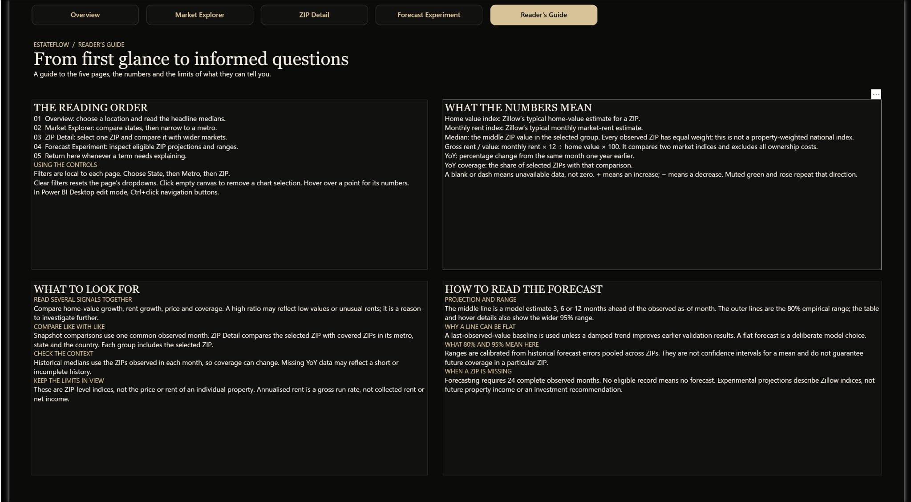
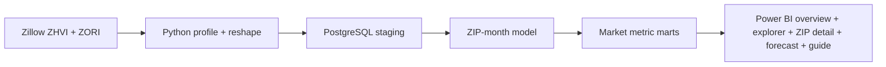

# EstateFlow

EstateFlow is a housing-market analytics project that takes Zillow home-value and rent data from raw monthly files through a repeatable Python and PostgreSQL pipeline into a Power BI market explorer. It is built around a simple standard: make the data traceable, make the comparisons understandable, and show where the data has limits.

## Use EstateFlow

- **[Download the ready-to-use Power BI report](https://github.com/yuvrajriyar/EstateFlow/releases/download/v1.0.0/EstateFlow_Dashboard.pbix)** (55 MiB): open `EstateFlow_Dashboard.pbix` in the latest free Power BI Desktop for Windows. All five pages and the imported August 2026 snapshot are included. You do not need PostgreSQL, Docker, a Power BI Pro subscription, or this repository to explore the saved report. Do not refresh unless you have configured your own database. In Desktop editing mode, hold Ctrl when clicking navigation buttons; select one ZIP on Forecast Experiment to populate the charts.
- **[Explore or rebuild the source project](#run-the-pipeline)**: use the Python pipeline, SQL models, editable PBIP, tests and source documentation below. The source project excludes the local Power BI data cache, so rebuild and refresh it to load data.

See the [October 2026 release notes](https://github.com/yuvrajriyar/EstateFlow/releases/tag/v1.0.0). Release month is October; the embedded Zillow observation month is August 2026. The PBIX SHA-256 is `ef79447f257286eabb99378f6bf239fceb36dae34fd9feed33bf61d4ab0d85f5`.

## Dashboard structure

The editable Power BI Project under `powerbi/EstateFlow_PowerBI_Analytics` contains five pages: a national housing-market overview, a state and metro market explorer, ZIP detail, a separately labelled forecast experiment, and a plain-English guide. The August database rebuild and forecast publication passed all pipeline quality gates locally. All five pages were refreshed and visually reviewed on 1 October 2026; the author confirmed navigation, Clear filters, and launcher-based startup reset. The report is verified locally, but a publicly interactive Power BI deployment is not yet available.

## Dashboard previews

### National housing market



### Market explorer



### ZIP detail



### Forecast experiment



### How to read the dashboard



## What it helps answer

- How do typical home values and rents compare across ZIP codes and over time?
- Where do home-value growth, rent growth, and gross rent-to-value diverge?
- Which ZIP codes are worth a closer look after filtering by state, metro, or city?
- How much of the current market has a valid year-over-year comparison?
- For eligible ZIPs, what do a simple baseline and validated trend model project at 3, 6 and 12 months, and how wide were their historically calibrated prediction bands?

The published sources run through **31 August 2026**, with **462,410 matched ZIP-month records across 8,424 ZIPs** and **8,421 ZIPs in the latest matched snapshot**. The verified coverage and forecast results are recorded in [the data summary](docs/current-data.md). A local refresh records its newer source vintage in `data/raw/source_manifest.json`. Dashboard screenshots show the August 2026 snapshot after a successful Desktop refresh. The gallery is a static preview; download the released PBIX to explore immediately, or clone the source project to rebuild it.

### Refresh to the latest available Zillow data

```bash
uv run python src/estateflow/update_sources.py &&
uv run python src/estateflow/run_pipeline.py &&
uv run python src/estateflow/run_forecast.py --publish-to-db
```

The downloader checks the ZIP schema, positive values, dates, and matching source months before replacing either file. It refuses an older vintage and records source URLs, retrieval dates, and hashes in `data/raw/source_manifest.json`. Zillow can revise historical values, so each refresh is a new source vintage. After the full pipeline and forecasts pass, commit the updated source files and manifest to publish that snapshot on GitHub. Update the data summary from the actual pipeline output and refresh Desktop screenshots before claiming they show the new vintage.

## How the data moves


```mermaid
flowchart LR
    A[Zillow ZHVI + ZORI] --> B[Python profile + reshape]
    B --> C[PostgreSQL staging]
    C --> D[ZIP-month model]
    D --> E[Market metric marts]
    E --> F[Power BI overview + explorer + ZIP detail + forecast + guide]
```

## What is implemented

### Ingestion and transformation

- Documented Zillow Home Value Index (ZHVI) and Zillow Observed Rent Index (ZORI), including their grain, coverage, units, gaps, and limitations.
- Profiled and reshaped wide monthly source files into analysis-ready ZIP-month records with Python and pandas.
- Automates ZORI and ZHVI loading into PostgreSQL, including chunked ZHVI loading and row-count reconciliation.
- Preserves ZIP codes as text so leading zeroes are not lost.
- Runs the staging, transformation, modelling, latest-snapshot, and data-quality steps through one pipeline entry point.

### Modelling and quality controls

- Uses separate PostgreSQL staging, intermediate, and mart layers.
- Builds `marts.zip_month_market_metrics` for historical ZIP-month analysis and `marts.latest_zip_market_metrics` for the latest common market snapshot.
- Calculates annualised rent, gross rent-to-value, home-value year-over-year change, and rent year-over-year change.
- Checks required values, positive measures, ZIP-month uniqueness, layer reconciliation, valid year-over-year comparisons, and derived-metric calculations.

### Power BI report

- **National Housing Market:** state, metro, and city filters; headline market medians; home-value and rent history; year-over-year indicators; coverage; and a ZIP-level market-opportunities table.
- **Market Explorer:** state and metro filters; a growth-versus-yield state comparison; rent-momentum ranking; and a metro comparison table.
- **How to Read the Dashboard:** explains the measures, suggests a practical reading order, and makes the coverage and investment-screening limitations explicit.
- **ZIP Detail:** historical home value and rent, growth, and comparison with state benchmarks for the selected ZIP.
- **Forecast Experiment:** ZIP-level home-value and rent-index projections and empirical 80%/95% bounds, explicitly separated from the observed pages; refreshed and visually checked locally with one selected ZIP.
- The editable Power BI Project (`.pbip`) and semantic-model/report definitions are in [`powerbi/EstateFlow_PowerBI_Analytics`](powerbi/EstateFlow_PowerBI_Analytics). Local Power BI cache and settings are intentionally excluded.

### Experimental forecasts

- A separate, reproducible ZIP-index forecast experiment compares an unchanged-last-value benchmark with a damped log trend at 3-, 6-, and 12-month horizons.
- It uses chronological selection, validation, calibration, and final-evaluation periods and reports empirical prediction-interval coverage. On the August 2026 source snapshot, only the 12-month rent trend cleared the material-improvement threshold; home-value projections and shorter-horizon rent projections use the flat benchmark. See [the current measured results](docs/current-data.md).
- A separate **Forecast Experiment** Power BI page and import table are authored. Run the explicit database publish step before refreshing Power BI; the August-vintage page has been checked locally. A forecast is not an observed Zillow value, a property valuation, or net rental income. See the [forecast methodology and measured results](docs/forecast-methodology.md).
- The August source files were downloaded, validated, and published on 1 October 2026. Forecast accuracy remains retrospective and exploratory; future-origin projections have not reached their target months.

## Analytical model

| Model | Grain | Use |
| --- | --- | --- |
| `marts.zip_month_market_metrics` | One ZIP code per month | Historical trends and year-over-year comparisons |
| `marts.latest_zip_market_metrics` | One ZIP code for the latest common month | Current-market rankings, medians, and filters |

The core gross rent-to-value calculation is:

```text
(monthly rent × 12 ÷ home value) × 100
```

Gross rent-to-value is a first-pass screening measure. It is not net yield, cash flow, or a complete investment return, and does not account for financing, vacancy, taxes, insurance, maintenance, management, or transaction costs. Zillow indices are modelled estimates, and coverage differs across geographies and months. Missing values are not estimated in the mart; the report surfaces year-over-year coverage so comparisons can be read in context.

## Technology

- Python 3.12, pandas, psycopg, uv
- PostgreSQL 17, SQL, Docker Compose
- Power BI Desktop Project (PBIP), DAX, Power Query
- Git and GitHub

## Run the pipeline

1. Clone the repository and create your local environment file:

   ```bash
   git clone https://github.com/yuvrajriyar/EstateFlow.git
   cd EstateFlow
   cp .env.example .env
   ```

2. Install the Python environment and start PostgreSQL:

   ```bash
   uv sync
   docker compose up -d
   ```

3. Run the pipeline from the repository root:

   ```bash
   uv run python src/estateflow/run_pipeline.py
   ```

   To rebuild the marts and run quality checks without reloading the source files:

   ```bash
   uv run python src/estateflow/run_pipeline.py --skip-loads
   ```

4. Open `powerbi/EstateFlow_PowerBI_Analytics/EstateFlow_Dashboard.pbip` in Power BI Desktop. The model expects the PostgreSQL service at `localhost:5432` and database `estateflow`; configure the local PostgreSQL credentials when prompted, then refresh the model.

To run the separate forecast experiment after the data pipeline:

```bash
uv run python src/estateflow/run_forecast.py
uv run python -m unittest discover -s tests -v
```

The database command reads the joined ZIP-month view and writes ignored CSVs under `data/processed/forecasts/`. Use `--source raw` to reproduce the same experiment from the committed raw files without PostgreSQL. After reviewing `forecast_evaluation.csv`, publish the separate forecast table for Power BI:

```bash
uv run python src/estateflow/run_forecast.py --publish-to-db
docker compose exec -T postgres psql -U estateflow_user -d estateflow -v ON_ERROR_STOP=1 -f - < sql/quality/check_zip_market_forecasts.sql
```

Then refresh the editable Power BI Project and review the **Forecast Experiment** page. The August-vintage page was rendered and checked locally on 1 October 2026. The established observed-data pipeline does not run forecasting automatically.

## Repository map

```text
docs/                       Source notes, data documentation, dashboard images
powerbi/                    Editable Power BI Project and dashboard blueprint
sql/staging/                Typed source tables
sql/intermediate/           Joined ZIP-month model
sql/marts/                  Historical and latest-market outputs
sql/quality/                Reconciliation and validation queries
src/estateflow/             Profiling, transformation, and pipeline runner
tests/                      Automated project tests
```

## Next steps

- Publish an interactive online report and verify visitor access. The five-page Desktop report, filter controls, and launcher reset have passed local acceptance.
- Prepare the final handbook and release package.
- Re-evaluate forecasts when new Zillow observations arrive; CI already runs unit and PostgreSQL quality-gate tests.
- Assess whether carefully selected FRED or Census measures improve the market context without overstating causal explanations.

## Sources

- [Zillow Research Data](https://www.zillow.com/research/data/)
- [ZHVI source notes](docs/source-notes-zhvi.md)
- [ZORI source notes](docs/source-notes-zori.md)
- [Power BI dashboard blueprint](powerbi/dashboard-blueprint.md)
- [Forecast experiment and limitations](docs/forecast-methodology.md)

## Author

Built by [Yuvraj Riyar](https://github.com/yuvrajriyar) as an independent analytics and data-engineering project.
