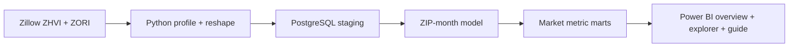

# EstateFlow

EstateFlow is a housing-market analytics project that takes Zillow home-value and rent data from raw monthly files through a repeatable Python and PostgreSQL pipeline into a Power BI market explorer. It is built around a simple standard: make the data traceable, make the comparisons understandable, and show where the data has limits.

## Dashboard structure

The report has three pages: a national housing-market overview, a state and metro market explorer, and a plain-English guide to reading the measures. The editable Power BI Project is included in this repository under `powerbi/EstateFlow_PowerBI_Analytics`.

## Dashboard previews

### National housing market


### Market explorer


### How to read the dashboard


## What it helps answer

- How do typical home values and rents compare across ZIP codes and over time?
- Where do home-value growth, rent growth, and gross rent-to-value diverge?
- Which ZIP codes are worth a closer look after filtering by state, metro, or city?
- How much of the current market has a valid year-over-year comparison?

The dashboard's latest shared Zillow observation is **July 2026**. In that snapshot, the joined model covers **8,499 ZIP codes**. The national medians shown are **$389,083** for home value, **$1,818** for monthly rent, and **5.59%** gross rent-to-value. These are descriptive market measures, not property-level investment returns.

## How the data moves


```mermaid
flowchart LR
    A[Zillow ZHVI + ZORI] --> B[Python profile + reshape]
    B --> C[PostgreSQL staging]
    C --> D[ZIP-month model]
    D --> E[Market metric marts]
    E --> F[Power BI overview + explorer + guide]
```

## What is implemented

### Ingestion and transformation

- Documented Zillow Home Value Index (ZHVI) and Zillow Observed Rent Index (ZORI), including their grain, coverage, units, gaps, and limitations.
- Profiled and reshaped wide monthly source files into analysis-ready ZIP-month records with Python and pandas.
- Automates ZORI and ZHVI loading into PostgreSQL, including chunked ZHVI loading and row-count reconciliation.
- Preserves ZIP codes as text so leading zeroes are not lost.
- Runs the staging, transformation, modelling, latest-snapshot, and data-quality steps through one pipeline entry point.

### Modelling and quality controls

- Uses separate PostgreSQL staging, intermediate, and mart layers.
- Builds `marts.zip_month_market_metrics` for historical ZIP-month analysis and `marts.latest_zip_market_metrics` for the latest common market snapshot.
- Calculates annualised rent, gross rent-to-value, home-value year-over-year change, and rent year-over-year change.
- Checks required values, positive measures, ZIP-month uniqueness, layer reconciliation, valid year-over-year comparisons, and derived-metric calculations.

### Power BI report

- **National Housing Market:** state, metro, and city filters; headline market medians; home-value and rent history; year-over-year indicators; coverage; and a ZIP-level market-opportunities table.
- **Market Explorer:** state and metro filters; a growth-versus-yield state comparison; rent-momentum ranking; and a metro comparison table.
- **How to Read the Dashboard:** explains the measures, suggests a practical reading order, and makes the coverage and investment-screening limitations explicit.
- The editable Power BI Project (`.pbip`) and semantic-model/report definitions are in [`powerbi/EstateFlow_PowerBI_Analytics`](powerbi/EstateFlow_PowerBI_Analytics). Local Power BI cache and settings are intentionally excluded.

## Analytical model

| Model | Grain | Use |
| --- | --- | --- |
| `marts.zip_month_market_metrics` | One ZIP code per month | Historical trends and year-over-year comparisons |
| `marts.latest_zip_market_metrics` | One ZIP code for the latest common month | Current-market rankings, medians, and filters |

The core gross rent-to-value calculation is:

```text
(monthly rent × 12 ÷ home value) × 100
```

Gross rent-to-value is a first-pass screening measure. It is not net yield, cash flow, or a complete investment return, and does not account for financing, vacancy, taxes, insurance, maintenance, management, or transaction costs. Zillow indices are modelled estimates, and coverage differs across geographies and months. Missing values are not estimated in the mart; the report surfaces year-over-year coverage so comparisons can be read in context.

## Technology

- Python 3.12, pandas, psycopg, uv
- PostgreSQL 17, SQL, Docker Compose
- Power BI Desktop Project (PBIP), DAX, Power Query
- Git and GitHub

## Run the pipeline

1. Clone the repository and create your local environment file:

   ```bash
   git clone https://github.com/yuvrajriyar/EstateFlow.git
   cd EstateFlow
   cp .env.example .env
   ```

2. Install the Python environment and start PostgreSQL:

   ```bash
   uv sync
   docker compose up -d
   ```

3. Run the pipeline from the repository root:

   ```bash
   uv run python src/estateflow/run_pipeline.py
   ```

   To rebuild the marts and run quality checks without reloading the source files:

   ```bash
   uv run python src/estateflow/run_pipeline.py --skip-loads
   ```

4. Open `powerbi/EstateFlow_PowerBI_Analytics/EstateFlow_Dashboard.pbip` in Power BI Desktop. The model expects the PostgreSQL service at `localhost:5432` and database `estateflow`; configure the local PostgreSQL credentials when prompted, then refresh the model.

## Repository map

```text
docs/                       Source notes, data documentation, dashboard images
powerbi/                    Editable Power BI Project and dashboard blueprint
sql/staging/                Typed source tables
sql/intermediate/           Joined ZIP-month model
sql/marts/                  Historical and latest-market outputs
sql/quality/                Reconciliation and validation queries
src/estateflow/             Profiling, transformation, and pipeline runner
tests/                      Automated project tests
```

## Next steps

- Add a repeatable automated test run in CI.
- Build and evaluate a statistically defensible forecast for home values and rents, with uncertainty intervals and clear back-testing.
- Assess whether carefully selected FRED or Census measures improve the market context without overstating causal explanations.

## Sources

- [Zillow Research Data](https://www.zillow.com/research/data/)
- [ZHVI source notes](docs/source-notes-zhvi.md)
- [ZORI source notes](docs/source-notes-zori.md)
- [Power BI dashboard blueprint](powerbi/dashboard-blueprint.md)

## Author

Built by [Yuvraj Riyar](https://github.com/yuvrajriyar) as an independent analytics and data-engineering project.
